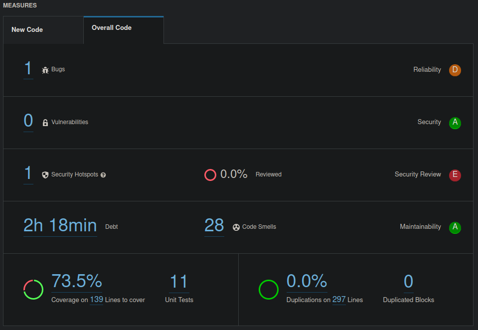
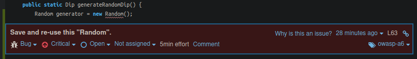
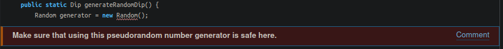
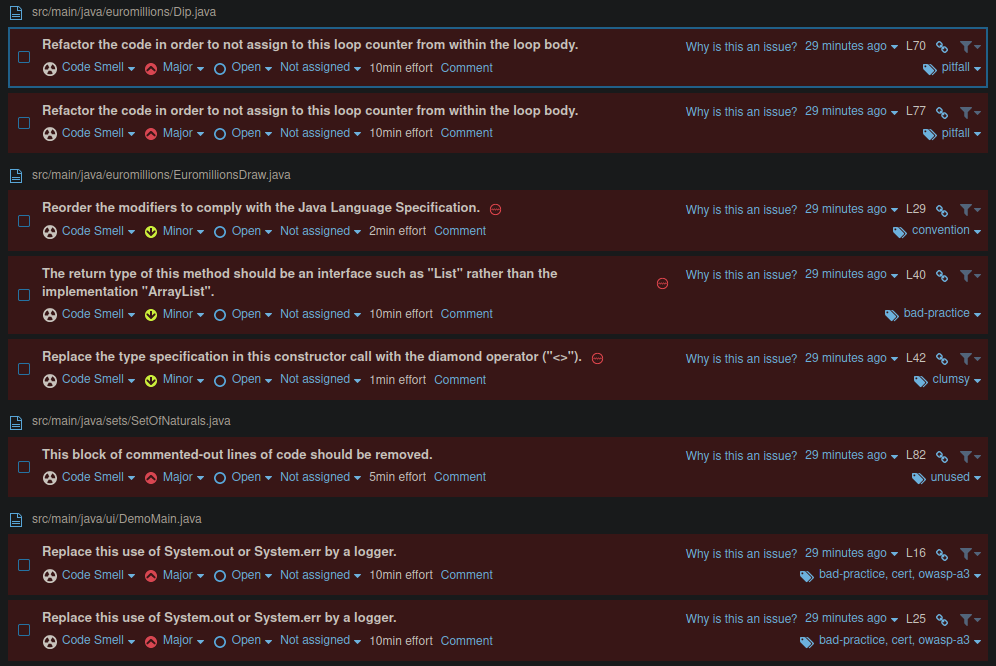

# Sonar analysis

The project has successfully passed the quality gate (all conditions passed).

## General metrics

| Count | Type              | Category        | Score |
|-------|-------------------|-----------------|-------|
| 1     | Bugs              | Reliability     | D     |
| 0     | Vulnerabilities   | Security        | A     |
| 1     | Security Hotspots | Security Review | E     |
| 28    | Code Smells       | Maintainability | A     |

The coverage was 73.5%, with 139 lines to cover. In total, there were 11 unit tests.

There were no duplications on 297 lines of code, with 0 duplicated blocks.



### Bugs

The only bug found was in class `Dip`, which created a random number generator on demand
(in this case, Java's `Random` class).
This is reported as a bug because the randomness of a random number generator is built for
a single instance of that generator. So, for an application, a single instance of a generator
is what should be used, or else the application also relies on the randomness of the seed provided
for these generators at the time of their invocation.
Not only that, instantiating a random number generator every time is inefficient.



### Security Hotspots

The security hotspot issue is also related to the random number generator. Depending on the functionality
of the application (on how reliant it should be on randomness), a different random number generator may be chosen
which provides less predictability. This is necessary for security critical applications.
Therefore, the report is warning us to do that analysis to see if this **pseudo**random number generator is appropriate
for our case.



### Code smells

Below are some of the reported code smells.



The major code smells reported above were:
- loop counters updated within the loop body, which are not only less efficient but also harder to understand and 
maintain
(the `i++` present in the `if` condition)
```java
for (int i = 0; i < NUMBER_QUANTITY; ) {
    int candidate = generator.nextInt(NUMBER_RANGE_MAX) + NUMBER_RANGE_MIN;
    if (!randomDip.getNumbersColl().contains(candidate)) {
        randomDip.getNumbersColl().add(candidate);
        i++;
    }
}
```
- reorder the writing of the modifiers, merely for convention purposes, which provides better readability to more people
(the `static` before `public`)
```java
static public EuromillionsDraw generateRandomDraw() {...}
```
- return interfaces instead of implementations, in order to hide implementation details
(the `ArrayList<Dip>` return type)
```java
public ArrayList<Dip> findMatches(CuponEuromillions playCuppon) {...}
```
- make use of the diamond operator `<>` to reduce verbosity
(instantiation of `ArrayList<Dip>()`)
```java
ArrayList<Dip> results = new ArrayList<Dip>();
```
- remove commented-out code as it bloats programs and reduces readability
```java
return this.size() == other.size() && collection.stream().allMatch(other::contains);
// return Objects.equals(this.collection, other.collection);
```
- replace usage of `System.out`/`System.err` by a logger, since the logger can provide much more useful functionality
and meets important logging requirements
```java
System.out.println("Betting with three random bets...");
```

## Issue solutions

Below is a table describing the major issues in this report and a way to solve them.

| Issue              | Problem description                                    | How to solve                                                                                                                                                   |
|--------------------|--------------------------------------------------------|----------------------------------------------------------------------------------------------------------------------------------------------------------------|
| Bug                | `Random` instance not reused                           | Initialize the random instance once on a `static final` attribute of the class, and make the method return the value of that variable                          |
| Code smell (major) | Loop counter updated in body                           | Instead of an `if` to test whether to go to the next iteration, block execution in that `for` iteration with a `while` loop until the desired condition is met |
| *                  | Commended-out lines of code                            | Delete those lines                                                                                                                                             |
| *                  | Usage of `System.out`/`System.err` instead of a logger | Use a logger implementation such as Java's `Logger`                                                                                                            |