# SonarQube analysis

After correcting the tests and copying the Lab3.2 project, the following SonarQube analysis report was obtained.

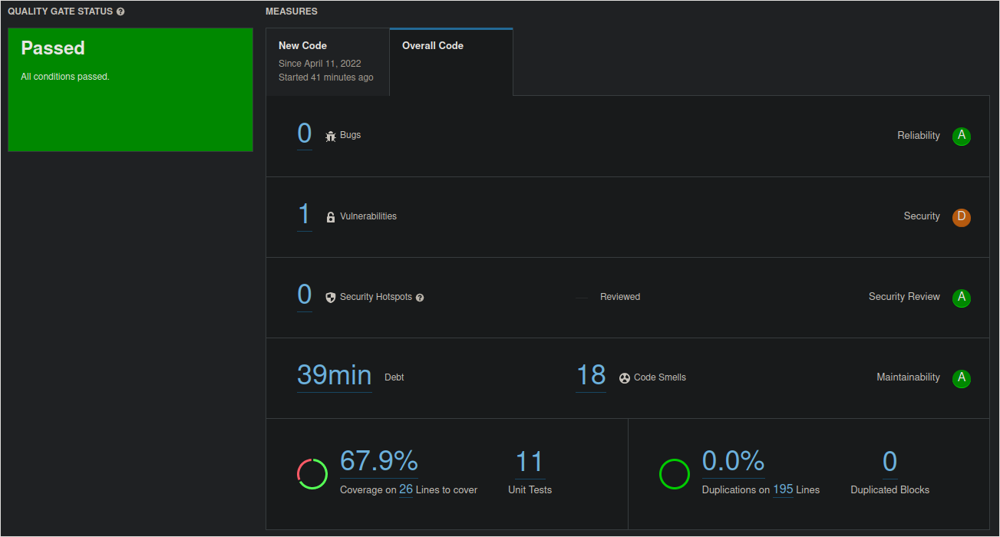

Overall, the project passed.

No bugs or security hotspots were reported, but one security vulnerability was spotted. 18 code smells were identified,
resulting in 39 minutes of *technical debt**.
With this, the **Reliability**, **Security Review** and **Maintainability** got maximum scores, while **Security** got a
D.

****Technical debt**: a metric to analyse how much refactoring work would be needed for this project, considering the
identified code smells. This report uses time units to describe this concept. In this case, this project has 39 minutes
of techical debt, which means that, on average, it would take 39 minutes to fix the 18 code smells.*

No duplication was found, but there was 67.9% coverage with 26 lines to cover, and 11 unit tests in total. Below are
more detailed statistics regarding the code coverage, as well as statistics for each class.

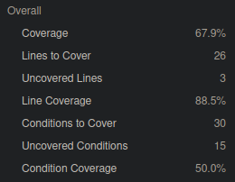

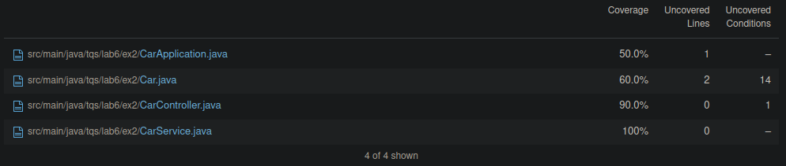

## Vulnerabilities

The vulnerability found has to do with the usage of a database entity as a request's body, in the `CarController` class.

This is an issue since it's possible for specially crafted user input to change the content of unexpected fields in the
database, since there are no restrictions on that front. There is also no abstraction from the database representation
of these entities. The recommended approach to solving this is using the DTO pattern.

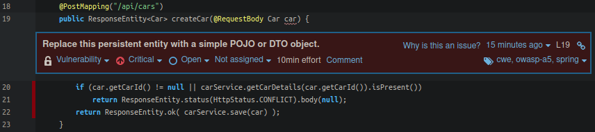

## Code smells

Regarding code smells, there were 17 code smells with **Info** severity value and 1 code smell with **Minor** severity.

### Info

All code smells with **Info** severity had to do with `public` modifiers that were unnecessary (related with JUnit5,
where the default package visibility is what's recommended, in contrast to JUnit4 which required the use of this
modifier).

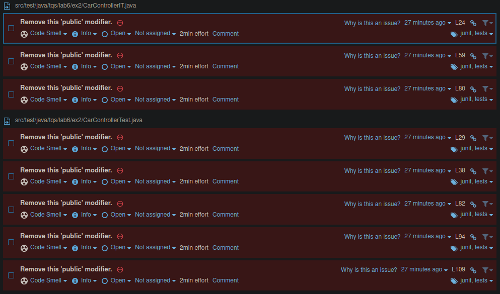

### Minor

The code smell with **Minor** severity has to do with the lack of AssertJ's assert method chaining in the test class
`CarRepositoryTest`, which causes duplication and reduces the clarity of the code.

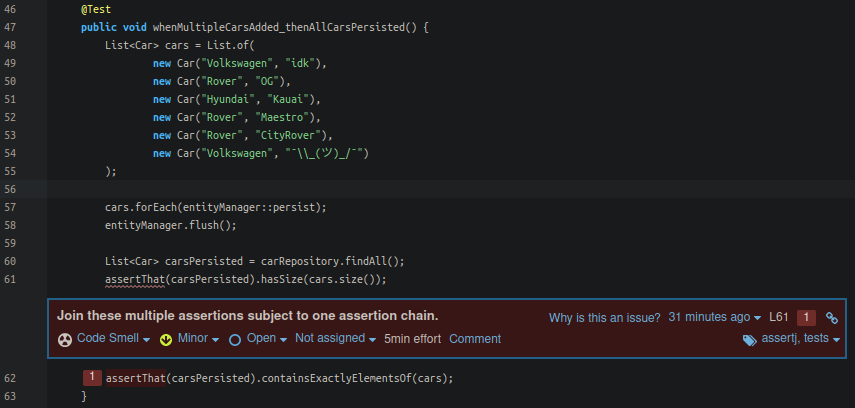

# SonarQube analysis 2

After fixing the previous vulnerability (DTO pattern), the project did not pass the quality test, having much less code
coverage (1 test was removed, since it tested for unnecessary functionality that was removed with the pattern).
The code smells were also fixed.

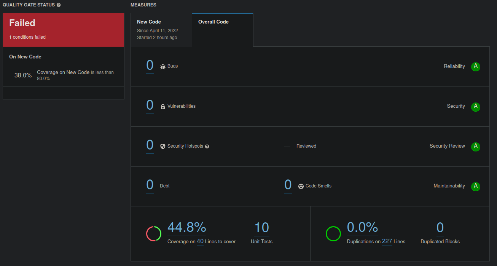

## Coverage

As it turns out, the reason the code coverage was reduced significantly was due to the `@Data` lombok annotation in the
`CarDTO` class, which adds plenty of boilerplate methods (`toString`, `equals`, `hashCode`, etc.).

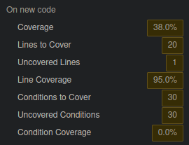

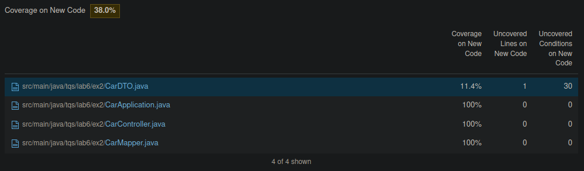

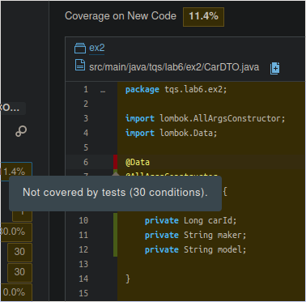

In order to prevent this convenience annotation from being evaluated, the following lines were added to the
`lombok.config` file located at the root of the project.

```lombok.config
config.stopBubbling = true
lombok.addLombokGeneratedAnnotation = true
```

# SonarQube analysis 3

After the previous lombok configuration was added, the project passed the quality gate.

For better code coverage, the `hashCode` and `equals` methods of the `Car` class were removed, as they were overriding
methods with an implementation which was already the default one (for Hibernate entities).

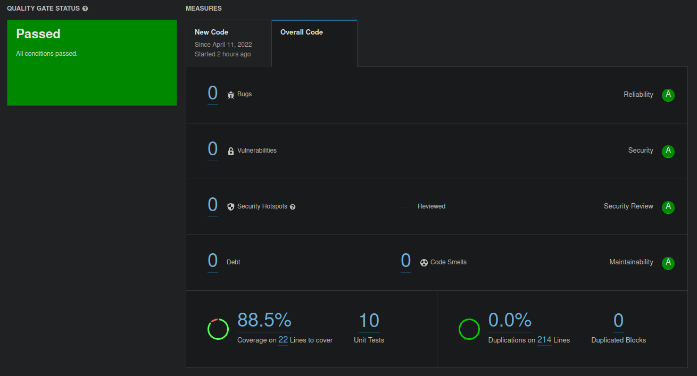