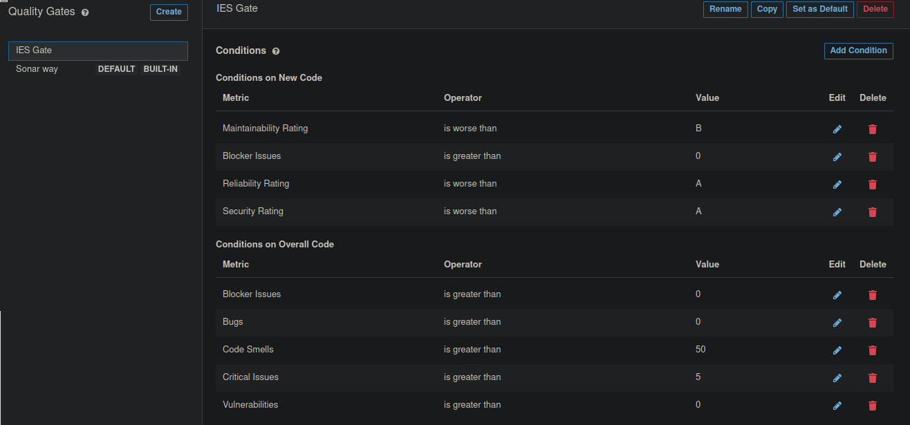
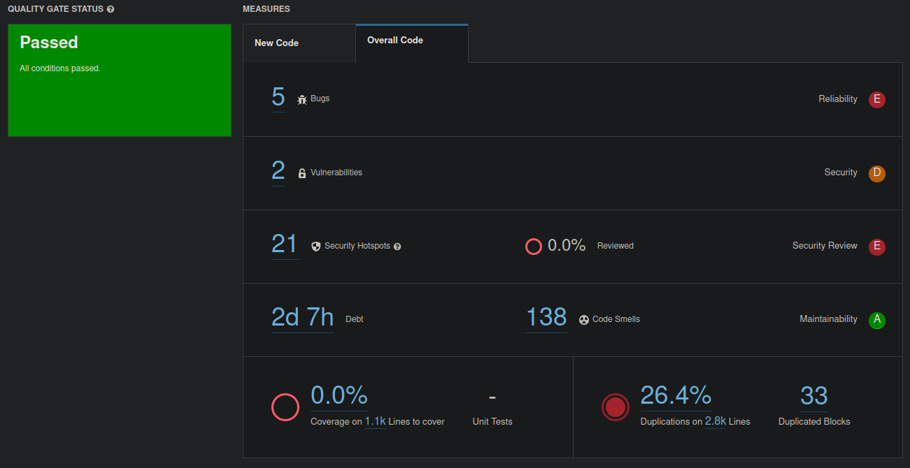
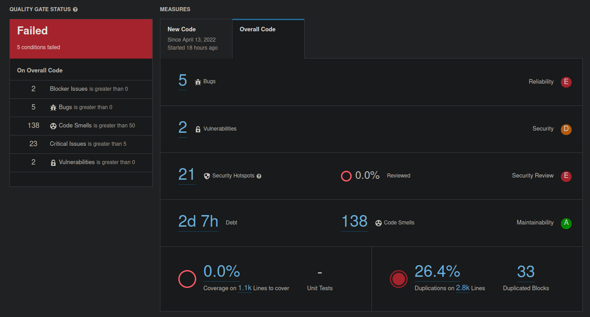
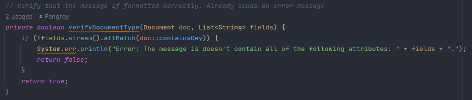
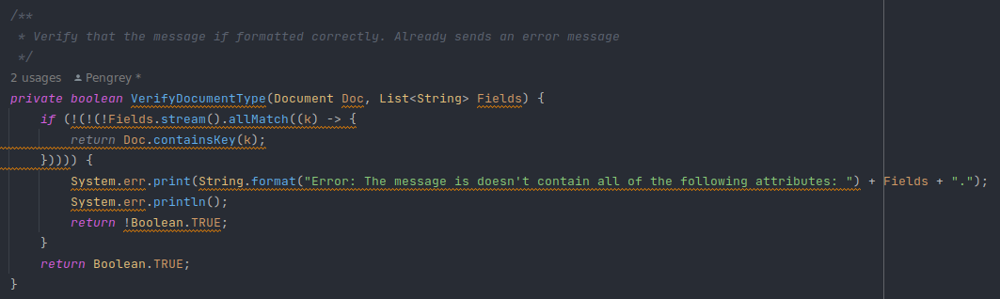
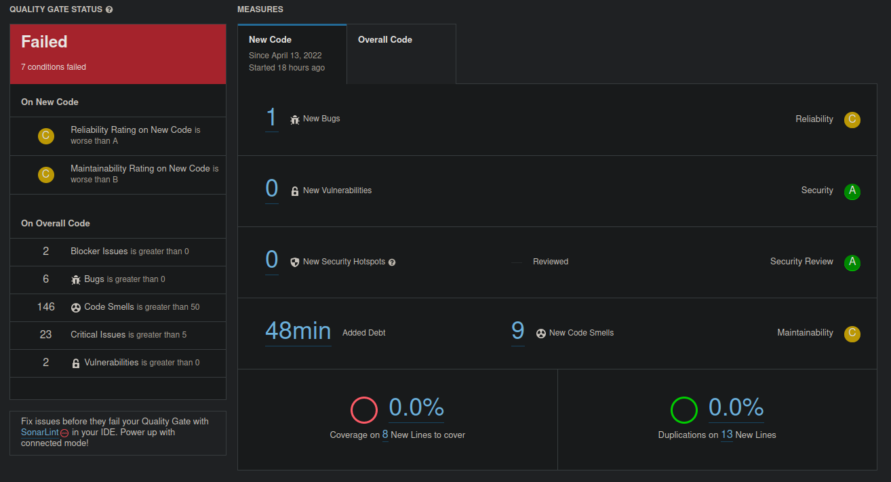
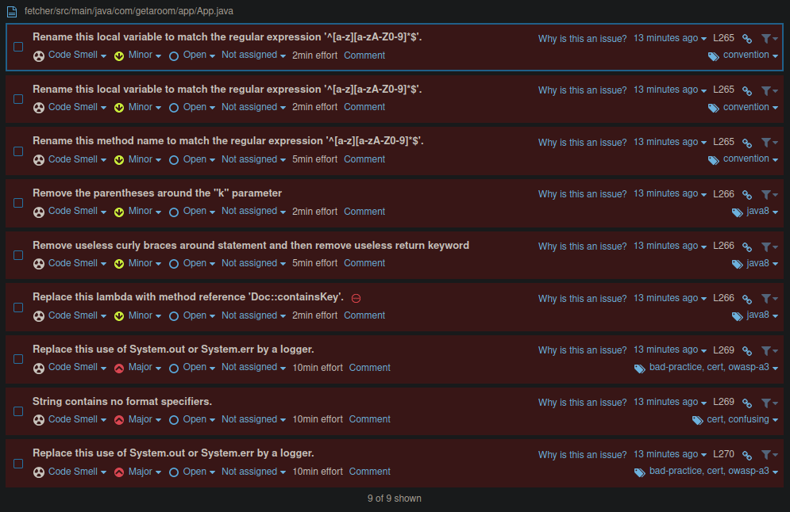
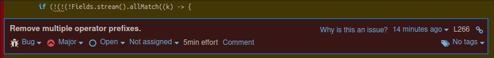

# Custom QG

In order to test a personalized Quality Gate, the IES project was reused. This project consists of 3 Web Apps and a Fetcher utility which communicates with a Message Broker, a MySQL database and a MongoDB database.

Considering the characteristics of the project, the following metrics were chosen to evaluate the project's quality:

## Conditions on New Code

| Metric                 | Operator        | Value |
|------------------------|-----------------|-------|
| Maintainability Rating | is worse than   | B     |
| Blocker issues         | is greater than | 0     |
| Reliability Rating     | is worse than   | A     |
| Security Rating        | is worse than   | A     |

For new code quality, we mainly chose ratings that are defined by SonarQube, since the size of new increments is not regular, so it doesn't make much sense to define absolute comparison values.

- **Maintainability Rating (<B)**: At the level that the project is, the entire code could use plenty of refactoring work, but at least new code should have an acceptable minimum of maintainability
- **Blocker issues (>0)**: Blocker issues, which can be a deterrent to overall development, should not be present in the project
- **Reliability Rating (<A)**: Bugs can produce unpredictable or weird behaviour on the application, and since an app such as the Security Guard's should also be robust, this metric has to be strict
- **Security Rating (<A)**: There should absolutely be no vulnerabilities, especially in the Security Guard's web app, which deals with private user information. Not only that, it contains functionality to block room access to a group of people, which shouldn't be compromised

## Conditions on Overall Code

| Metric          | Operator     | Value |
|-----------------|--------------|-------|
| Blocker issues  | greater than | 0     |
| Bugs            | greater than | 0     |
| Code smells     | greater than | 50    |
| Critical issues | greater than | 5     |
| Vulnerabilities | greater than | 0     |

For overall code quality, we chose personalized conditions based on absolute values, as at this point we are aware of the project's overall size.

- **Blocker issues (>0)**: For the same reason as stated above, but on overall code
- **Bugs (>0)**: (Effectively equal to Reliability Rating of A)
- **Code smells (>50)**: Even though this project put functionality over quality, concern should still be put in its readability if other developers were to take over it (which could be seen as a prototype). Since the project is of a relatively considerable size, and more than one person worked on various aspects of it, then the likelihood of a bad practice being repeated multiple times is high. Therefore, a high number, such as 50, was chosen to combat this phenomenon
- **Critical issues (>5)**: Critical issues have less probability of gravely affecting the application in production when compared with blocker issues, but they should also be paid attention to
- **Vulnerabilities (>0)**: (Effectively equal to Security Rating of A)

# Results on Sonar Way

*There was no new code, and since the Sonar Way focuses on analysing new code ("Clean as You Code"), the project passed.*

# Results on IES Gate

*Since quality wasn't at the forefront of the project's development, this harsh Quality Gate didn't make it pass. However, if the Sonar Way checked the overall code as well, then it wouldn't have passed with that gate too.*

# Trying to break the IES Gate

In order to break the IES Gate (on new code) with code smells, the increment should have a Maintainability Rating worse than B which, at the time of writing, SonarQube considers to be equal to 6 to 10% of Technical Debt Ratio.

The code that was chosen to introduce the code smells was the following: `com.getaroom.app.App.verifyDocumentType` at `fetcher`. The code with a yellow underline contains suggestions for change from IntelliJ and SonarLint (plugin).

### Before

### After

The following changes were introduced:

- Changed method name and argument's names to be uppercase (break naming convention)
- Redundant `not`s on the `if` condition
- Usage of a lambda with body (and parenthesized parameter) instead of method reference
- Redundant `String.format`
- Usage of `System.err.print` followed by `System.err.println` when one `System.err.println` could be used
- Returning the `false` boolean value as the inverse of the `true` value
- Usage of the `Boolean` class to return primitive booleans

### Result

As expected, the new code failed to pass the quality gate, introducing 9 code smells which translate to 48 minutes of added Technical Debt, resulting in a Maintainability rating worse than B.

Unintentionally, however, a new bug was introduced, making the new code also fail due to Reliability issues.

Below are the created code smells, and the bug.

